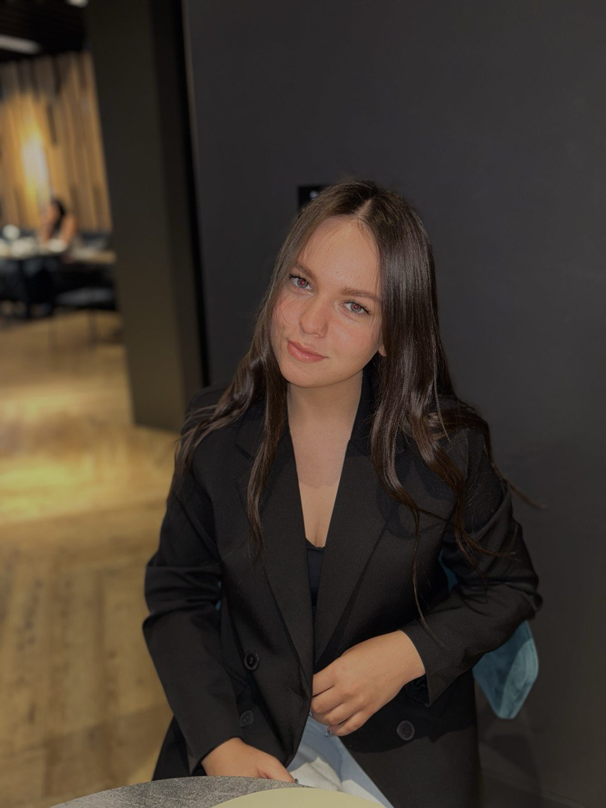

# Darina Ivanova

> Read the world through the eyes of the heart



---

### Navigation
- [Contact information](#contact-information)
- [About Me](#about-me)
- [Skills](#skills)
- [Code example](#code-example)
- [Experience](#experience)
- [English language](#english-language)

---

### Contact information 
**Telephone:** +375(33) 308-71-10  
**Email:** ivanova.darina.pir241@mail.ru  
**Instagram:** [@daarinka_i](https://www.instagram.com/daarinka_i)

---

## About Me
I'm a second-year student at the **Belarusian-Russian University**. I'm in my second year of studying in the **Electrical Engineering Department**, majoring in **Software Engineering**.

---

## Skills
- **Programming Languages**: C#
- **Databases**: Microsoft Access
- **Tools**: Visual Studio

---

## Code Example
```csharp
Random random = new Random();
Console.Write("Введите размер массива: ");
int n = Convert.ToInt32(Console.ReadLine());
int[] array = new int[n];

for (int i = 0; i < array.Length - 1; i++)
{
    for (int j = 0; j < array.Length - 1 - i; j++)
    {
        array[i] = random.Next(-10, 10);
    }
}
Console.WriteLine("Начальный массив: " + string.Join(" ", array));
```
---

## Experience
- Electronic catalog **"Laser Printers"** in C# WinForm
- Game application development. **"Academy of Swords and Magic"** subsystem
- Development of the **"Online Programming Courses"** information system
- **Travel agency** application in C# WinForm

---

## English language 
My English level is **A1**.
